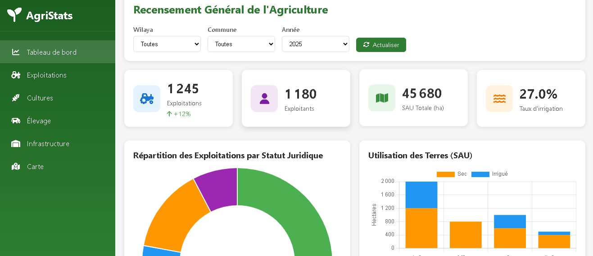
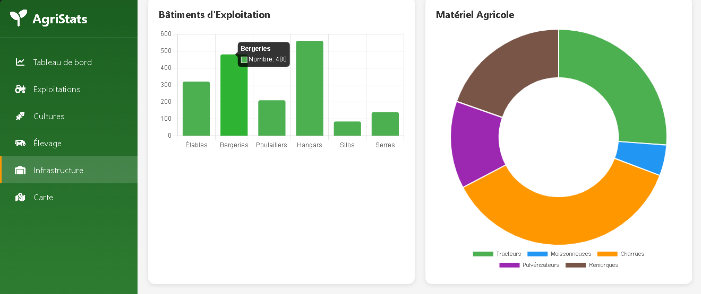

# Dashboard-_fron-end
Interactive Agricultural Census Dashboard that visualizes key statistics using a modern frontend and a powerful backend API.


# 🌾 Agricultural Census Dashboard

## 📖 Description
This project is an interactive web dashboard designed to visualize the main statistics of the agricultural census. It helps users explore agricultural data such as crop distribution, land usage, and production insights in a clear and dynamic way.

The application is divided into two main parts:
- Frontend (user interface)
- Backend (API and data processing)

---

## 🚀 Features
- 📊 Interactive charts using Chart.js
- 🌍 Visualization of agricultural data
- 🔄 Dynamic data from backend API
- 📱 Responsive design (mobile & desktop)
- ⚡ Fast and simple user interface

---

##Architecture

-Frontend (Web)
     ↓
 -REST API
     ↓
-Backend
     ↓
-Database

---

## 🧩 Technologies Used

### Frontend
- HTML
- CSS
- JavaScript
- Chart.js

### Backend
- FastAPI / Node.js (update based on your backend)

### Database
- PostgreSQL (with PostGIS if used)

---

## 🏗️ Architecture

Frontend (Web)
↓
REST API
↓
Backend
↓
Database

---

## ▶️ How to Run the Project

### 1. Clone the repository
```bash
git clone https://github.com/khaira372/front-end.git


## 📸 Screenshots

<p align="center">
  
</p>

<p align="center">
  
</p>
